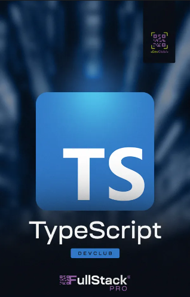
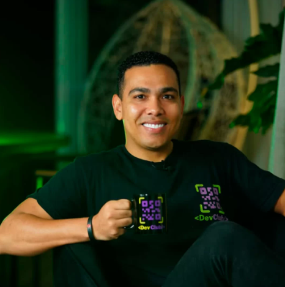

## Meu Caderno de React - DevClub

   

## Sobre o Curso

A Formação Devclub é a formação mais completa de programação que você já viu, uma vez que você aprende do zero ao avançado para em menos de 06 meses estar atuando como um programador full stack.

A Formação possui mais de 35 módulos e entre eles aulas completas de HTML, CSS, Javascript, Node, Banco de dados, React e muito mais!

Sem contar com as aulas liberadas constantemente como potencializador do seu aprendizado.

 

## Sobre o Professor

Sou ex-eletricista do Metrô de São Paulo e fiz a minha transição de carreira graças a programação. Comecei no mercado aos “trancos e barrancos”, estudando no meu tempo livre que tinha nos feriados e fins de semana para me tornar programador.

Tomei 13 NÃOs antes de aparecer meu primeiro SIM, mas ele veio – mesmo sem ter faculdade! Meu primeiro emprego foi como programador no Santander, mas também já trabalhei em empresas como BTG Pactual, PI Investimentos e Toro Investimentos.

Hoje o meu propósito é ajudar o máximo de pessoas a transformarem suas vidas por meio da programação.

 <a href="https://www.linkedin.com/in/agustinhopneto/" target="_blank">Rodolfo Mori</a>

## Tecnologias Utilizadas

  &nbsp;

## Sobre o Aluno

🎓 Análise de Sistemas - Cruzeiro do Sul  
💻 Estudante FullStack: Dio.me / DevClub  
👩🏻‍💻 Autor do Site: <a href="https://igorlazzaretti.com/">igorlazzaretti.com</a>  
📚 Leitor e Estudante de Inglês   
🧙‍♂️ Fã de Harry Potter    

##

> "Acredite nos seus sonhos"   - Igor Dossin Lazzaretti

<!-- ICONES

https://devicon.dev/

 -->